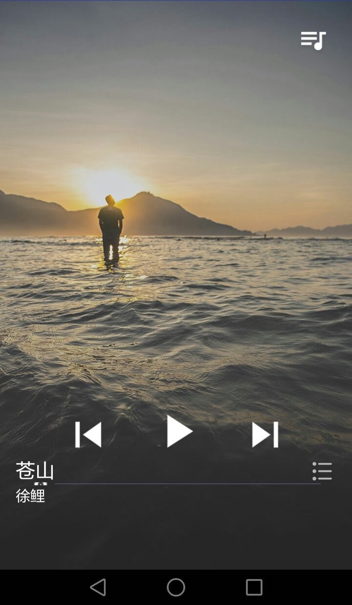

# LHZMusicPlayer
My Final Assignment in the first semester of junior year.

In current Version, "launch automatic webpage generator" get no support any more. After we choose our theme in settings, we can edit the README.md this file, which will be displayed on your project webpage.

Screenshot from my phone

Video from my phone
https://www.bilibili.com/video/av11394295/?from=search&seid=9137291263524629400

------------------------------------------------------------------------------

At last, thanks to the help from Friday Saarelaht. He helped me revise the mistake of file path I made before.
